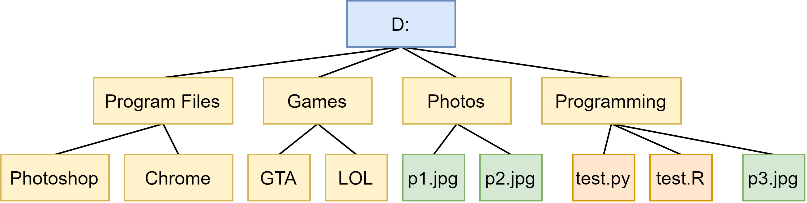

# 0x00 Basic Knowledge

A note contains the basic knowledge in computer science

## Overview

- Operation System
- File System (Path)

## Operating System

- Windows: Windows XP, Windows 7, Windows 8, Windows 10
- Linux / Unix: Ubuntu, Debian, macOS

In most cases, we use Windows. However, in development, we commonly use Linux, and personally, I think it is quite essential, especially in the era of big data.

## Path: Absolute and Relative Path

Path: name of file or directory

Path for a directory:

```null
C:\Users\liuzongdong\Desktop
```

Path for a file:

```null
C:\Users\liuzongdong\Desktop\machine_learning.docx
```

Absolute Path: or full path, points to the same location in a file system.

Relative Path: Starts from some given working directory

What is working directory?

For example:

Yang Lu: "I am going to `Queenstown`"

Jin Cheng: "I live at `Fifth Avenue`"

Yang Lu's location is Singapore, for her, she knows what Queenstown is. As for Jin Cheng, the Fifth Avenue is meaningful in her perspective. Hence, the `Queenstown` and `Fifth Avenue` only works for certain individual, and other people cannot understand it and find it properly.

Yang Lu's working directory: Singapore

Jin Cheng's working directory: USA

If we change our expression:

Yang Lu: "I am going to `Queenstown Singapore`"

Jin Cheng: "I live at `Fifth Avenue, New York, America`"

Both sentences work for everyone on the earth right now

Let's see the picture here:



It is a dummy file system indicates the files and directories inside the drive D. Assume that you are at the folder `Programming`

1. What is the working directory for the script: `test.R` and `test.py` ?
2. Write down the Absolute path of `p1.jpg`
3. How can `test.R` access the file `p3.jpg` ?
4. How can `test.py` access the file `p1.jpg` through absolute path?
5. How can `test.py` access the file `p2.jpg` through relative path?

For the question five, we need to know a new thing: `Parent Directory`

Just like the example we used before, the `Parent Directory` for `Queenstown` is `Singapore`, in computing, we use the following statement for `Parent Directory`

```null
..
```

For Yang Lu:

```null
I live in ..
```

means

```null
I live in Singapore
```

Another thing we need to know is `Directory Separator`

Please check the path here:

```null
C:\Users\liuzongdong\Desktop\machine_learning.docx
```

In this case, `\` is the `Directory Separator

Here's a little table for the differences between Windows and Linux

| Operation System |           Root Directory           | Parent Directory | Directory Separator |
| :--------------: | :--------------------------------: | :--------------: | :-----------------: |
|     Windows      | [drive letter:] for example: C: D: |        ..        |       / or \        |
|      Linux       |                 /                  |        ..        |          /          |

Hence, if `test.py` want to access the `p1.jpg` through a relative path fashion, we should locate the `p1.jpg` by

```null
../Photos/p1.jpg
```

### Change Directory

If you want to change the current directory in a Terminal, you need use the following command and a path

```bash
cd
```

For example, if you want to move back to the `Games` folder

```bash
cd Games/
```

Question: How to go back to `Parent Directory` using `cd` command?

**Why I show you this:**

- Because in most case, no Windows, only Linux, like Ubuntu or Debian
- Sometimes, the location of script and the data is separated
- Absolute path is buggy if you give your code to others
