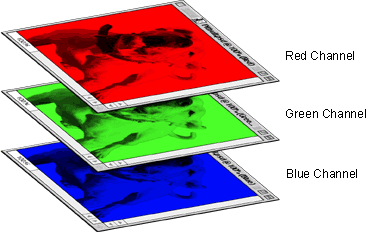
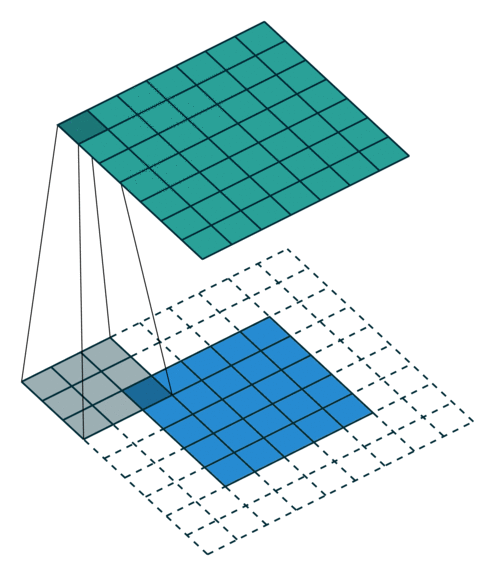

# 0x02 Images and CNN

## Today's Agenda

- Learn the basic of images and CNN
- Skim the VGG paper
- Introduction to Keras (optional)
- Get familiar with the training set (optional)
- Numpy (optional)

## Introduction

Convolutional Neural Networks (**CNN** or **ConvNet**) are a category of Neural Networks, commonly used in fields such as image recognition and classification. For example: identifying faces, objects, and traffic signs. Firstly, Let's see a picture of a traditional CNN classification structure.


<center><i>CNN Network</i></center>

 We will go through several concepts, please check the following 

- Images (Input)
- Convolutional Layer
- ReLU Layer
- Pooling Layer
- Flatten Layer
- Fully Connected Layer
- Mix them up!

## What are Images

Every image can be represented as a matrix of pixel values. 


<center><i>Some 8s from the data set</i></center>

To a computer, an image is really just a grid of numbers that represent how dark each pixel is. Please check the following gif as an example:


<center><i>CNN Network</i></center>

**Channel** is a conventional term used to refer to a certain component of an image. 

### Normal Image

An image from a standard digital camera will have ***three*** channels – red, green and blue (**RGB**) 

You can imagine those as three 2d-matrices stacked over each other (one for each color), each having pixel values in the range **0** to **255** 
$$
max = 2^8 = 256
$$
However, we start from zero, hence the max value of pixel is 255. Please check the following image as an example of RGB stack



<center><i>RGB Stack</i></center>


### Grayscale Image

A grayscale image, on the other hand, has just one channel. The value of each pixel in the matrix will range from 0 to 255 – zero indicating white and 255 indicating black.


<center><i>Grayscale Image</i></center>

## Convolution Layer

ConvNets derive their names form the Convolution Operation. The primary purpose of Convolution in case of a ConvNet is to **extract features** from the input image.

Based on the previous information, a image is just a matrix, to extract the features, we need to know a new concept: Kernel: In image processing, a **kernel**, **convolution matrix**, or **mask** is a small matrix. It is used for blurring, sharpening, edge detection, and more.


<center><i>Different Kernels</i></center>

As we discussed above, every image can be considered as a matrix of pixel values. Consider a 5 x 5 image whose pixel values are only 0 and 1 (note that for a grayscale image, pixel values range from 0 to 255, the green matrix below is a special case where pixel values are only 0 and 1):


Also, consider another 3 x 3 matrix as shown below:


Then, the Convolution of the 5 x 5 image and the 3 x 3 matrix can be computed as shown in the animation in the following figure:


<center><i>The Convolution operation. The output matrix is called Convolved Feature or Feature Map</i></center>

Another good way to understand the Convolution operation is by looking at the animation in the following animation


<center><i>The Convolution operation</i></center>

A filter (with red outline) slides over the input image (convolution operation) to produce a feature map. The convolution of another filter (with the green outline), over the same image gives a different feature map as shown. Let's again check the movement of kernel.


<center><i>Movement of Kernel</i></center>

The size of the Feature Map is controlled by four parameters: **Depth**, **Kernel Size,** **Stride**, **Padding**

- **Depth**: Depth is the number of kernel. The number of feature map equals to the number of filters (kernels).
- **Kernel Size**: The kernel size defines the field of view of the convolution. A common choice for 2D is 3 — that is 3x3 pixels
- **Stride**: The stride defines the step size of the kernel when traversing the image By default, the stride is set to one.
  - Purpose: by striding, we can reduce the matrix calculation between the original input and filter, in order to boost the efficiency. 
  - Stride value too big: Information lost. we cannot extract the feature properly
  - Stride value too small: Too many calculations
- **Padding**: or Zero-padding, the padding defines how the border of a sample is handled. Sometimes, it is convenient to pad the input matrix with zeros around the border

Let's see a set of animations to get more detailed information

*Blue maps are inputs, and cyan maps are outputs.*

<table style="width:100%; table-layout:fixed;">
  <tr>
    <td></td>
    <td></td>
    <td></td>
    <td></td>
  </tr>
  <tr>
    <td>No padding, no strides</td>
    <td>Padding: 2, no strides</td>
    <td>Padding: 1, no strides</td>
    <td>Padding: 2, no strides</td>
  </tr>
  <tr>
    <td></td>
    <td></td>
    <td></td>
    <td></td>
  </tr>
  <tr>
    <td>No padding, strides: 2</td>
    <td>Padding: 1, strides: 2</td>
    <td>Padding: 1, strides: 2 (odd)</td>
    <td></td>
  </tr>
</table>


$$
feature\ map\ size = \lfloor \frac{n+2p -f}{s} \rfloor   + 1
$$
Where *n* is the size of input, *p* is the padding value, *f* is the size of filter, and *s* is the value of stride

> Important! In TensorFlow, there are two options for padding, they are "SAME" and "VALID"

For example:

- Input width = 13
- Filter width = 6
- Stride = 5

`VALID` = without padding:

```
   inputs:         1  2  3  4  5  6  7  8  9  10 11 (12 13)
                  |________________|                dropped
                                 |_________________|
```

`SAME` = with zero padding:

```
               pad|                                      |pad
   inputs:      0 |1  2  3  4  5  6  7  8  9  10 11 12 13|0  0
               |________________|
                              |_________________|
                                             |________________|
```


After that, we will use another animation to demonstrate the 3-channel convolution


<center><i>RGB Convolution, padding: 1, stride: 1</i></center>

## ReLU Layer

ReLU stands for rectified linear unit. An additional operation called ReLU has been used after every Convolution operation, and is a type of activation function. Mathematically, it is defined as *y = max(0, x)*. Visually, it looks like the following:


<center><i>ReLU: *y = max(0, x)</i></center>

Let's see the actual effect of ReLU function in the following image:


## Pooling Layer

Similar to the Convolutional Layer, the Pooling layer is responsible for reducing the spatial size of the Convolved Feature. We use pooling layer to downsampling the feature maps. 

There are two types of Pooling: Max Pooling and Average Pooling. 

- **Max Pooling** returns the **maximum value** from the portion of the image covered by the Kernel
- **Average Pooling** returns the **average of all the values** from the portion of the image covered by the Kernel
- Max Pooling performs as a **Noise Suppressant**. It discards the noisy activations and dimensionality reduction
- Average Pooling simply performs dimensionality reduction

Hence, we can say that **Max Pooling performs a lot better than Average Pooling**.

Please check the following image for a better understanding of two pooling types


<center><i>Max pooling and average pooling</i></center>

> Important: The **size** of the **pooling** operation or filter is smaller than the **size** of the feature map; specifically, it is almost always 2×2 pixels applied with a stride of 2 pixels. However, we will use the TensorFlow's SAME option

## Flatten Layer

For the Flatten Layer, please check the videos :)

<video src="img\flatten_01.mp4"></video>

<center><i>Tom flattened by Jumbo</i></center>

<video src="img\flatten_02.mp4"></video>

<center><i>Tom flattened by Jumbo</i></center>

Flatten Layer is used to convert the feature maps into a column vector (1D)

## Fully Connected Layer

**Fully Connected**: implies that every neuron in the previous layer is connected to every neuron on the next layer.

The **output** from the convolutional and pooling layers: **High-level features** of the input image. 

The purpose of the Fully Connected Layer: Use these features for classifying the input image into various classes based on the training dataset.

The Fully Connected layer is a traditional Multi Layer Perceptron that uses a SoftMax or SVM activation function in the output layer.

> Note: Adding a fully-connected layer is also a (usually) cheap way of learning non-linear combinations of these features. Most of the features from convolutional and pooling layers may be good for the classification task, but combinations of those features might be even better

The sum of output probabilities form the Fully Connected Layer is 1. This is ensured by using the [Softmax](http://cs231n.github.io/linear-classify/#softmax) as the activation function in the output layer of the Fully Connected Layer


<center><i>Sample of Fully Connected Layer</i></center>

## Mix Them up - Training using Backpropagation

As discussed above, the **Convolution + Pooling** layers act as **Feature Extractors** from the input image while **Fully Connected layer** acts as a **classifier**. Let's see a example here.


- Input Image = Boat
- Target Vector = [0, 0, 1, 0]

The overall training process of the Convolution Network may be summarized as below:

- **Step 1**: Initialize all filters and parameters / weights with random values
- **Step 2**: The network takes a training image as input, goes through the forward propagation step (Convolution, ReLU and pooling operations along with forward propagation in the Fully Connected layer) and finds the output probabilities for each class.
  - Lets say the output probabilities for the boat image above are [0.2, 0.4, 0.1, 0.3]
  - Since weights are randomly assigned for the first training example, output probabilities are also random

- **Step 3**: Calculate the total error at the output layer using the following equation (summation over all 4 classes)

$$
E_{total} = \sum \frac{1}{2} (target - output)^2
$$

- **Step 4**: Use **Backpropagation** to calculate the *gradients* of the error with respect to all weights in the network and use *gradient descent* to update all filter values / weights and parameter values to minimize the output error

> For the **Step 4** I think you guys should know much much much better than me, so maybe you can teach me sometime? 

- **Step 5**: Repeat steps 2-4 with all images in the training set.

The procedure of Step 5 is also called `epoch`: Train the datasets over and over and over again.

After training the model, we save the model, in fact we save the weight of each layer.

## Conclusion

In this note, I tried to explain the main ideas and concepts behind CNN, some details and complex math operations are skipped and simplified.

All images and animations used in this note belong to their respective authors